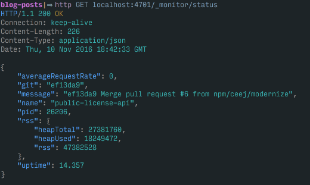

# npm's first Rust service

---

# [fit] the problem: add a feature to
# [fit] npm's __simplest__ microservice

---

# why was this __non-trivial__?

- the microservice was old: vintage 2014
- not git-deployable
- used old configuration (like, really old)
- no modcons

---

# [fit] Chris's __challenge__ to me:
# [fit] don't just add the feature
# [fit] but rewrite it in __Go__

---

# requirements

- a __public__ proxy in front of license-api
- proxy GET requests from npm-e installations to fetch license data
- proxy POST callbacks from Stripe

---

# requirements

- a __public__ proxy in front of license-api
- proxy GET requests from npm-e installations to fetch license data
- proxy POST callbacks from Stripe
- _new!_ send the Stripe callbacks to a 2nd destination!

---

# [fit] I spent an afternoon __rewriting__ the
# [fit] existing javascript service

---

# [fit] fallback plan in case
# [fit] my rewrite __failed__

---

# [fit] let's look at code
# [fit] \(condensed quite a bit)

---

```js
var server = require('restify').createServer({ name: 'public-license-api' });
var proxy = require('http-proxy').createProxyServer();

Monitor(server); // <--- adds our monitoring hooks
server.get('/license/:productId/:billingId/:licenseKey', fetchLicense);
server.post('/stripe/callback', stripeCallback);

server.listen(process.env.port, process.env.host || '0.0.0.0', function() {
    logger.info(`starting public-license-api on port ${process.env.PORT}`);
    process.emit('metric', {name: 'start'});
});
```

---

# and the request handlers look like this

```js
function stripeCallback(req, res, next)
{
  proxy.web(req, res, { target: process.env.PRIVATE_LICENSE_API });
  next();
};
```

So. Little. Code.

---

# [fit] task: learn Go, then reimplement
# [fit] I bounced off __Go__ hard

---

# [fit] no modern dependency management
# [fit] ran into WTF is GO_PATH immediately
# [fit] verbose language with no payoffs
# [fit] no new ideas since the 70s

---

# [fit] give up? nah.
# [fit] I decided to give __Rust__ a try.

---

# [fit] systems language
# [fit] aka designed for writing __systems__
# [fit] canonical examples: C & C++

---

# [fit] more __direct__ access to hardware/memory
# [fit] more __control__ / more responsibility
# [fit] PITA vs performance tradeoff

---

# [fit] systems languages are what
# [fit] __everything else__ is implemented in

---

# [fit] __Mozilla__ invented Rust
# [fit] to write their next browser in
# [fit] "safe, concurrent, practical language"

---

# [fit] modern FP language features
# [fit] no garbage collection
# [fit] a compiler that does its best to help

---

# [fit] no exceptions, only return values
# [fit] `match` on the Some<T>, None option
# [fit] can you say monad? sure you can

---

```rust
fn get_env_var<'a>(name: &'a str) -> std::string::String
{
    match env::var_os(name)
	{
		Some(v) => v.to_string_lossy().into_owned(),
		None => String::from(""),
	}
}
```

---

# [fit] best feature: __cargo__/crates.io
# [fit] modern dep management
# [fit] a package manager based on semver

---

# [fit] writing an http proxy in Rust
# [fit] is crushing a walnut with a __piledriver__

---

# [fit] __perfect__ for learning
# [fit] because the problem itself is trivial

---

# [fit] we have perf-critical work coming up
# [fit] best to get experience __now__

---

# [fit] So I dove in.

---


How hard can it be?

---

# [fit] here's the spine of the app
# [fit] __rust__-flavored this time

---

```rust
fn main()
{
    let mut server = Pencil::new("stripe-receiver");
    let metrics = get_env_var("METRICS");
    let port = get_env_var("PORT");
    let host = get_env_var("HOST");

    monitoring::monitor(&mut server, metrics); // Logging is now enabled.

    server.get("/license/<product_id:string>/<billing_id:string>/<licence_key:string>", "license", fetch_license);
    server.post("/stripe/callback", "stripe", handle_stripe);

    let listen_path = format!("{}:{}", host, port);
    info!(slog_scope::logger(), "listening on {}", listen_path);
    server.run(&*listen_path);
}
```

---

# [fit] [pencil](http://fengsp.github.io/pencil/pencil/): http framework
# [fit] inspired by flask
# [fit] familiar to users of restify

---

# first step: implement __/ping__

```rust
pub fn ping(_: &mut Request) -> PencilResult
{
    Ok(Response::from("pong"))
}
```

Not so bad!

----

# [fit] next: __/status__
# [fit] which does a deeper look...

---



---

- uptime
- memory use
- PID
- git commit hash
- git commit message
- request rate!

---

# [fit] __yak shave time__

---

# [fit] [ceejbot/git-latest-commit](https://github.com/ceejbot/git-latest-commit)
# [fit] my first Cargo crate
# [fit] a __build dep__ that writes a file

---

# [fit] logging & env vars

```rust
let port = get_env_var("PORT");
let host = get_env_var("HOST");
let listen_path = format!("{}:{}", host, port);
info!(slog_scope::logger(), "listening on {}", listen_path);
```

---

# [fit] chose `slog` for logging
# [fit] global scope, can do json

---

```rust
pub fn status(_: &mut Request) -> PencilResult
{
  let pid = format!("{}", psutil::getpid());
	let thisproc = Process::new(psutil::getpid());
	let rssbytes = match thisproc
	{
		Ok(v) => v.rss,
		Err(e) => { println!("{:?}", e); 0 }
	};

  let mut seconds = get_now_millis();
  unsafe { seconds = seconds - starttime; }

  let uptime = format!("{:.0}", seconds);
  let rss = format!("{}", rssbytes);

  let mut status = BTreeMap::new();
  status.insert("name", "stripe-receiver");
  status.insert("pid", &*pid);
  status.insert("version", env!("CARGO_PKG_VERSION"));
  status.insert("uptime", &*uptime);
  status.insert("rss", &*rss);
  status.insert("git", GIT_HASH);
  status.insert("message", GIT_SUMMARY);
  return jsonify(&status);
}
```

---

# [fit] omg __metrics__
# [fit] [numbat-metrics/rust-emitter](https://github.com/numbat-metrics/rust-emitter)

---

# [fit] [numbat-emitter](https://github.com/numbat-metrics/numbat-emitter) is __deeply__
# [fit] idiomatic node

---

# re-writing it in rust has been work

- JSON is, well, native to JS but not to Rust
- current API doesn't hide the serde_json choice
- learned about lazy_static and mutexes

---

```rust
let mut point_defs: BTreeMap<&str, Value> = BTreeMap::new();
point_defs.insert("x", serde_json::to_value("global"));

emitter().init(point_defs, "numbat-emitter");
emitter().connect("tcp://localhost:4677");
emitter().emit_name("initialization");
emitter().emit_name_val_tag("response", 23, "status", "200");
```

---

# [fit] error handling ha ha ha
# [fit] doesn't retry, doesn't reconnect
# [fit] but the __happy path__ works!

---


^ It emits metrics!

---

# [fit] the server is operationalized
# [fit] now actually __proxy__ something!

---

```rust
fn proxy_request(request: &Request, request_body: Vec<u8>,
  target: &str, target_host: &str)
  -> Result<hyper::client::Response, hyper::Error>
{
	use hyper::header::Host;
	let client = hyper::Client::new();

	let mut headers = request.headers.clone();
	headers.set(Host {
		hostname: target_host.to_string(),
		port: None
	});

	let proxy_response = try!(
		client.request(request.method.clone(), target)
		.headers(headers).body(&request_body[..]).send());

	Ok(proxy_response)
}
```

---

# [fit] current status:
# [fit] in __staging__, handling traffic successfully

---

# to-do list

1. finish up the metrics emitter & publish it
1. contribute Pencil changes back upstream
1. continue to learn Rust idioms & rewrite
1. fix my proxy code omg
1. build server & build artifact deployer

---

# [fit] conclusion: we can write
# [fit] perf critical services in __Rust__
